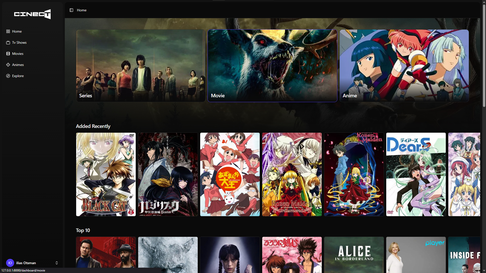
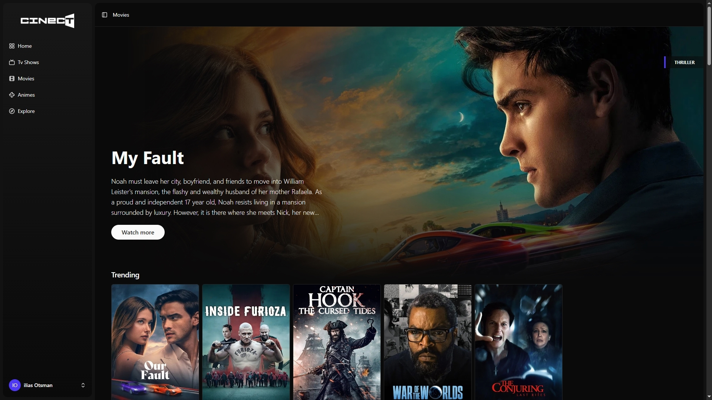
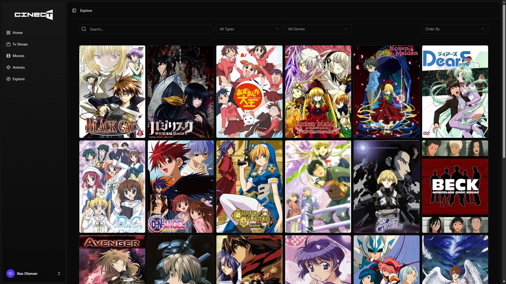
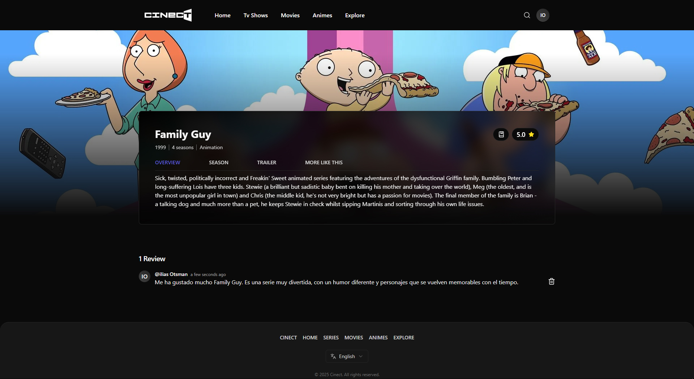
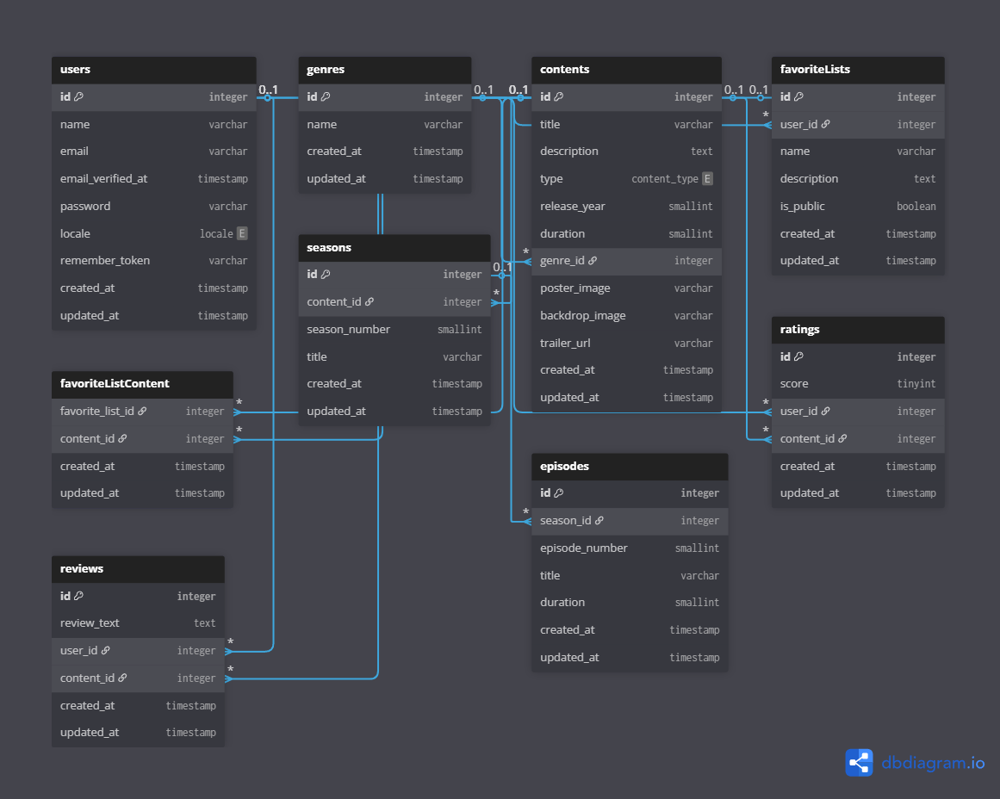

<div align="center">

# 🎬 Cinect

Proyecto final del Ciclo Formativo de Grado Superior en Desarrollo de Aplicaciones Web (DAW).
Cinect es una aplicación web para explorar, valorar y organizar contenido multimedia de películas, series y animes. Esta versión es una reimplementación moderna del proyecto original de 2021, enfocada en buenas prácticas de desarrollo, escalabilidad y uso de tecnologías actuales.

</div>

---

## 📸 Capturas de pantalla

<div align="center">
  
  
  
  
</div>

---

## 🚀 Tecnologías utilizadas

**Backend**
- Laravel 12
- MySQL

**Frontend**
- Inertia.js
- Vue 3
- Tailwind
- Vue-i18n

**Integraciones**
- **The Movie Database (TMDB) API** – Fuente principal de datos para películas y series.  
  Se obtienen los géneros y la información detallada (título, sinopsis, imágenes, año de lanzamiento, duración, etc.).  
  Los datos se procesan y normalizan antes de insertarlos en la base de datos, evitando duplicados y asignando los géneros correspondientes.
  
- **Jikan API** – Fuente principal de datos para animes.  
  Se obtiene la información general y, cuando está disponible, se crean las temporadas y episodios asociados.
  Los datos se transforman para mantener una estructura coherente con el resto de los contenidos de la aplicación.

---

## 🛠️ Instalación

#### Requisitos previos
- PHP 8.2 o superior  
- Composer  
- Node.js y npm  

```bash
# Clonar el repositorio
git clone https://github.com/IliasVilux/fp-cinect.git

# Navegar al directorio del proyecto
cd fp-cinect

# Instalar dependencias
composer install
npm install
```

#### Configuración del entorno
1. Configurar el archivo `.env`:
```bash
# Mysql
DB_CONNECTION=mysql
DB_HOST=xxxx
DB_PORT=xxxx
DB_DATABASE=xxxx
DB_USERNAME=xxxx
DB_PASSWORD=xxxx

# SQlite (local)
# Crear el archivo de base de datos
touch database/database.sqlite

DB_CONNECTION=sqlite
DB_DATABASE=${DB_DATABASE}/database.sqlite
```

#### Migraciones y seeders
Ejecuta las migraciones y seeders para generar la estructura y rellenar datos iniciales con factories:

```bash
php artisan migrate --seed
```

Esto creará los usuarios de prueba, contenidos y géneros utilizando los factories definidos en el proyecto.

#### Iniciar el servidor
```bash
composer run dev
```

---

## 🧩 Arquitectura y organización

En este proyecto he fusionado la base de **Laravel** con las buenas prácticas que he aprendido utilizando **Vue**, aplicando principios de **separación de responsabilidades**, **modularidad** y **mantenibilidad**.  
El objetivo es lograr una estructura limpia, escalable y fácil de extender.

#### Backend
- **Migraciones** y **modelos**: Definen la estructura de la base de datos y las relaciones entre entidades, garantizando la integridad y coherencia de los datos. 
  Las migraciones permiten versionar el esquema y facilitar su despliegue en distintos entornos.
- **Rutas**: Agrupadas por responsabilidad en `auth.php`, `settings.php`, `web.php` y por temática, utilizando prefijos, buena convención de nombres y protegidas por middleware.
- **Controladores**: Contienen la lógica necesaria para recibir la petición, validar datos y devolver el componente correspondiente de Vue mediante Inertia.
- **Servicios**: Llamados por los **controladores**, encapsulan toda la lógica de negocio, favoreciendo la mantenibilidad.

#### Frontend
El código del frontend se organiza en el directorio `/resources`, que contiene todo lo relacionado con **Inertia.js** y **Vue 3**.
- **Pages**: Agrupadas por funcionalidad (`auth`, `content`, `dashboard`, `favorite-lists`, `settings`) y con un componente dedicado para la landing page (`Welcome.vue`).
- **Componentes**:
  - `app/`: Componentes globales (sidebar, header, footer, logo).  
  - `base/`: Componentes reutilizables básicos (input, select, link).
  - `common/`: Componentes compartidos en distintos contextos (headings, cards, etc.).
  - `pages/`: Componentes específicos de cada vista (`dashboard`, `dashboard-type`, `detail`, `explore`, `favoriteLists`, `welcome`).
  - `ui/`: Componentes provenientes de la librería **shadcn-vue**.
- **Composables**: Funciones reutilizables como `useInitials` o `getImage`, que encapsulan lógica común entre componentes.
- **Lang**: Sistema de internacionalización con archivos JSON organizados por idioma (`es` y `en`), manteniendo las traducciones separadas por página o funcionalidad.
- **Types**: Definiciones de tipos y estructuras TypeScript utilizadas para asegurar consistencia en los datos del frontend.

---

## ✨ Funcionalidades principales

#### Autenticación
- Registro, login y recuperación de contraseña con envío de correos (reset de contraseña pendiente de configurar).
- Middleware auth protege las rutas privadas y el acceso a contenido personalizado.

#### Dashboard
- Vista principal con botones para cada tipo de contenido: **Películas**, **Series** y **Animes**.
- **Carruseles dinámicos**: Muestran contenido aleatorio o clasificado (Top 10, Para ti, Tendencias, etc.).
- **Hero destacado**: Cada tipo de contenido muestra una portada aleatoria con título, descripción y enlace al detalle.

#### Detalle
- Información completa: título, descripción, tipo, año, duración, géneros, temporadas y capítulos (si aplica), e integración del tráiler.
- Sistema de **valoraciones y reseñas**:
  - Los usuarios pueden valorar un contenido (1 a 5 estrellas).
  - Las reseñas requieren tener una valoración previa.
  - Se puede eliminar solo la reseña o el rating completo (lo cual borra también la reseña asociada).
- Posibilidad de **añadir o quitar el contenido de las listas** personales del usuario.

#### Listas de favoritos
- Crear, editar y eliminar múltiples listas de favoritos personalizadas.
- Añadir o eliminar contenidos de las listas de manera individual.
- Evita duplicados: un mismo contenido no puede repetirse dentro de la misma lista.
- Campo `is_public` para definir si la lista será **pública o privada**, con vista futura a un apartado de **listas de la comunidad**.

#### Explore
- Catálogo global que permite descubrir nuevo contenido.
- Búsqueda por texto, tipo de contenido y género.
- Filtros combinables, ordenamiento dinámico y paginación para mejorar la experiencia del usuario.

#### Configuración
- Modificación de datos del perfil (nombre y correo electrónico).
- Cambio de contraseña con validación de contraseña actual.

#### Internacionalización
- Soporte multilenguaje (español e inglés) con **Vue-i18n**.

---

## 🗄️ Base de datos y seeders

<div align="center">
  
</div>

#### 🧬 Factories y Seeders
- Las **factories** se utilizan principalmente en los tests, generando datos falsos de forma rápida, controlada y repetible.  
- Los **seeders** llenan la base de datos con datos reales obtenidos de las APIs de **TMDB** y **Jikan**, procesando y normalizando la información antes de insertarla.  
- Se crean registros para **películas, series, animes, géneros, temporadas y episodios**, manteniendo una estructura coherente entre todos los tipos de contenido.

```bash
# Para ejecutar el seeder:
php artisan db:seed --class=ContentSeeder --verbose
```

---

## 🧪 Tests

Los tests se han realizado con Pest y se encuentran en `tests/Feature`. Cubren tanto la parte **backend** (modelos, controladores, servicios y lógica de negocio) como la **integración frontend** mediante **Inertia.js**, verificando que los componentes, rutas y datos compartidos se rendericen correctamente.

```bash
# Para ejecutar los tests:
./vendor/bin/pest
```
